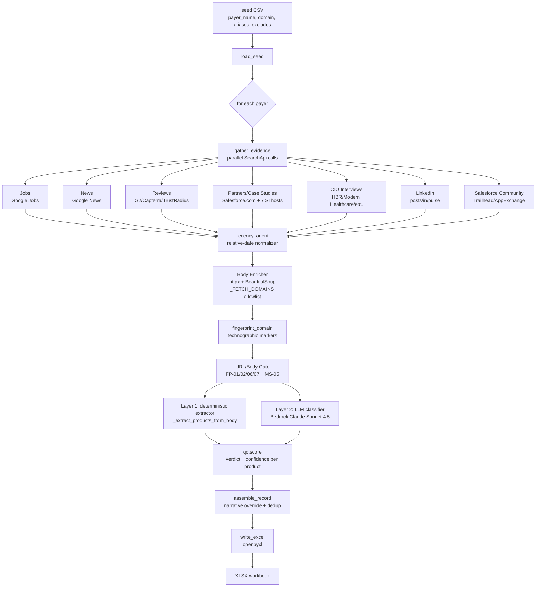

# Payer Intelligence — Salesforce Usage Detection for US Health Plans

An automated multi-agent pipeline that, given a CSV of US health-plan payers, produces an Excel workbook scoring each payer on **11 Salesforce products** with verdicts (`Yes` / `Likely` / `No` / `Unknown`), confidence scores, source URLs, and a narrative key-evidence summary suitable for BD outreach.

```
seed_payers.csv  →  [11-agent pipeline]  →  enterprise_BD_Salesforce_Payer_Intelligence_YYYYMMDD.xlsx
```

---

## Why this exists

Sales BD teams targeting health plans need to know which Salesforce clouds each payer already runs so outreach is informed (cross-sell vs. greenfield) and not random. Manual research takes ~30 min per payer and goes stale fast. This tool runs each payer in ~90 s, applies deterministic false-positive guards (`FP-01`…`FP-07`), grounds verdicts in dated source URLs, and emits a workbook the team can ship.

---

## Tech stack

| Layer | Choice |
| --- | --- |
| Language | Python 3.11+ |
| Agent framework | [CrewAI](https://github.com/crewAIInc/crewAI) |
| LLM | AWS Bedrock — Claude Sonnet 4.5 (via `litellm`) |
| Web search | [SearchApi.io](https://www.searchapi.io/) Google / Google News / Google Jobs |
| HTML fetch | `httpx` + `BeautifulSoup` |
| Excel | `openpyxl` |
| Test | `pytest`, `pytest-mock`, `respx` |

---

## Quick start

```powershell
# 1. Clone & enter
git clone https://github.com/amiiiirsaman/Payer_Salesforce.git
cd Payer_Salesforce

# 2. Virtualenv + deps
python -m venv .venv
.\.venv\Scripts\Activate.ps1
pip install -r requirements.txt

# 3. Configure secrets (.env at repo root)
@'
SEARCHAPI_API_KEY=...
AWS_ACCESS_KEY_ID=...
AWS_SECRET_ACCESS_KEY=...
AWS_REGION=us-east-1
BEDROCK_MODEL_ID=anthropic.claude-sonnet-4-5-20250929-v2:0
'@ | Out-File -Encoding utf8 .env

# 4. Smoke run (1 payer, ~90 s)
python main.py --seed data/seed_payers_smoke.csv --out out/smoke

# 5. Open the workbook
ii out/smoke/enterprise_BD_Salesforce_Payer_Intelligence_*.xlsx
```

Full 62-payer batches live in [data/seed_payers_62.csv](data/seed_payers_62.csv) (or the 3 split batch files for parallel execution).

### CLI flags

| Flag | Default | Purpose |
| --- | --- | --- |
| `--seed` | `data/seed_payers_smoke.csv` | Input CSV path |
| `--out` | `out` | Output directory (workbook + run log) |
| `--log-level` | `INFO` | `DEBUG` / `INFO` / `WARNING` |

`main.py` pre-checks SearchApi quota (`7 × seed_count` searches) and aborts before burning credits if the account is short.

---

## Architecture



Two-layer classification is the core design:

- **Layer 1 (deterministic)** — `_extract_products_from_body` scans enriched page bodies with strict regex + alias-proximity windows. Fast, free, and audit-friendly. Catches obvious cases (Vlocity → Health Cloud, `pardot.com` → Pardot).
- **Layer 2 (LLM)** — `_classify_with_llm` sees only items that survived the gate, with regex hits surfaced as hints. Handles nuance the regex misses (employee titles, narrative phrasing, sibling-entity reasoning).

Both feed `qc.score`, which applies a strict precedence ladder (case study > LinkedIn + corroborator > 2× LinkedIn > recent multi-source > single recent signal > stale).

---

## Agents at a glance

All 11 agent constructors live in [src/payer_intel/agents.py](src/payer_intel/agents.py). They are wired into the deterministic pipeline in [src/payer_intel/crew.py](src/payer_intel/crew.py); the `Agent()` objects act as named hand-off points, role anchors, and prompt scaffolding for the LLM stages.

| # | Function | Role | Input | Output | Tool |
| --- | --- | --- | --- | --- | --- |
| 1 | `orchestrator_agent` | BD Intelligence Orchestrator | Seed row | Coordinates sub-agents, owns final QA | — |
| 2 | `target_identification_agent` | Target List Curator | Raw payer list | Canonical name + public domain | — |
| 3 | `jobs_agent` | Job Posting Analyst | Payer name + aliases | Recent job-posting URLs naming Salesforce products | `GoogleJobsTool` |
| 4 | `news_agent` | PR & News Intelligence | Payer name + aliases | Press releases announcing Salesforce deployments | `GoogleNewsTool` |
| 5 | `reviews_agent` | Software Review Analyst | Payer name | G2/Capterra/TrustRadius reviews from payer employees | `GoogleSearchTool` |
| 6 | `case_study_agent` | Case Study & Partner Researcher | Payer name + aliases | Salesforce.com / SI-partner success stories | `GoogleSearchTool` |
| 7 | `technographic_agent` | Technographic Fingerprint Analyst | Payer public domain | Salesforce infrastructure markers in HTML/headers | `TechFingerprintTool` |
| 8 | `recency_agent` | Temporal & Recency Auditor | Evidence list | Normalized ISO dates; stale items flagged | — |
| 9 | `classifier_agent` | Salesforce Product Taxonomy Classifier | Filtered evidence + regex hints | Strict-JSON product → evidence mapping + narrative | Bedrock Claude Sonnet 4.5 |
| 10 | `qc_agent` | Quality Control Analyst | Per-product evidence | `Yes` / `Likely` / `No` / `Unknown` + confidence | — |
| 11 | `export_agent` | Excel Export Specialist | Validated `PayerRecord` list | Excel workbook in target schema | `openpyxl` |

---

## End-to-end flow

1. **`load_seed`** ([crew.py](src/payer_intel/crew.py)) — parses the CSV (`utf-8-sig` BOM-safe), preserving all columns including `search_aliases` and `search_excludes`.
2. **`gather_evidence`** — for each payer, fires 7+ parallel SearchApi calls:
   - Google Jobs scoped to product terms (`Sales Cloud`, `Health Cloud`, `Vlocity`, …)
   - Google News scoped to deployment verbs
   - Google web search on G2/Capterra/TrustRadius (`_REVIEW_SITES`)
   - Google web search on Salesforce.com partner pages + 7 SI hosts (`_PARTNER_SITES`)
   - Google web search on CIO/trade press (`_CIO_INTERVIEW_SITES`)
   - Google web search on LinkedIn posts/profiles/pulse (`_LINKEDIN_SITES`) — snippet-only, no body fetch
   - Google web search on Trailhead/AppExchange community (`_COMMUNITY_SITES`)
3. **Recency normalization** — relative dates (`"2 days ago"`, `"last month"`) are converted to ISO via the SearchApi relative-date parser; items missing dates default to "unknown date" (excluded from the recency tier).
4. **Body enrichment** — for any URL whose host is in `_FETCH_DOMAINS`, `httpx` fetches the page and `BeautifulSoup` extracts visible text (capped at `_MAX_BODY_CHARS`). LinkedIn is intentionally **not** on the allowlist (blocks unauthenticated httpx).
5. **Technographic fingerprint** — `fingerprint_domain` in [tech_fingerprint.py](src/payer_intel/tools/tech_fingerprint.py) probes 9 well-known paths on the payer domain (`/members`, `/login`, `/s/`, …) for single-pattern markers (`my.salesforce.com`, `pardot.com`) and two-pass candidate+confirmation pairs (e.g. `my.site.com` only counts when paired with `/sfsites/`, defeating FP-03).
6. **URL/body gate** — `_should_drop_evidence` applies:
   - `_is_zero_evidence_url` (Salesforce blog category/tag/author/paginated indexes)
   - `_si_partner_requires_payer_mention` (SI brochures must visibly name the payer — URL-fragment mentions stripped before check, per **FP-06**)
   - `_salesforce_blog_lacks_customer_verb` (a salesforce.com `/blog/` page must put a deployment verb within ±400 chars of a payer alias, per **FP-01**)
   - `_evidence_body_contains_exclude` (sibling entities like `AmeriHealth Caritas` for Independence Blue Cross are dropped, per **MS-05**)
7. **Layer 1 — `_extract_products_from_body`** — strict regex with alias-proximity windows (`_PROXIMITY_WINDOW=400`) and a tighter window for Agentforce (`_AGENTFORCE_PROXIMITY=200`, deployment-indicator required). Weak single-word aliases (e.g. `"health"`, `"cigna"`) filtered out to prevent cross-payer contamination.
8. **Layer 2 — `_classify_with_llm`** — Bedrock Claude Sonnet 4.5 receives the filtered evidence list with regex hints, strict JSON output schema, and the FP-01/05/06/07 + MS-04/05/06 guards inlined into the prompt (former-employee rule, Tier-1 employee-title rule, etc.). Returns `{product: [evidence_idx]}` + narrative summary.
9. **QC — `qc.score`** — per product, applies the rule ladder in [qc.py](src/payer_intel/qc.py) (see [QC rule ladder](#qc-rule-ladder)).
10. **`assemble_record`** — merges per-product verdicts, applies the narrative-override rule (a hard "no credible evidence" line in the summary clears any straggling LIKELY verdicts), dedupes source URLs, computes overall confidence.
11. **`write_excel`** ([export.py](src/payer_intel/export.py)) — emits `enterprise_BD_Salesforce_Payer_Intelligence_YYYYMMDD.xlsx` with a Data sheet and a Summary dashboard.

---

## QC rule ladder

`qc.score(product, evidences)` evaluates rules in this order; first match wins. Source: [src/payer_intel/qc.py](src/payer_intel/qc.py).

| Priority | Trigger | Verdict | Confidence | Note |
| --- | --- | --- | --- | --- |
| 1 | Any `case_study` evidence | Yes | High | `official case study` |
| 2 | ≥1 LinkedIn + technographic | Yes | High | `linkedin employee + technographic` |
| 3 | ≥1 LinkedIn + recent job (≤365d) | Yes | High | `linkedin employee + recent job` |
| 4 | ≥1 LinkedIn + recent news (≤365d) | Yes | High | `linkedin employee + recent news` |
| 5 | ≥2 distinct LinkedIn URLs | Yes | High | `multiple linkedin employees` |
| 6 | recent job + recent review | Yes | High | `recent job + recent review` |
| 7 | recent job + recent news | Yes | High | `recent job + recent news` |
| 8 | recent job + technographic | Yes | High | `recent job + technographic` |
| 9 | 1 LinkedIn alone | Likely | Medium | `linkedin employee signal` |
| 10 | recent job alone | Likely | Medium | `recent job posting only` |
| 11 | recent review alone (≤730d) | Likely | Medium | `recent review only` |
| 12 | recent news alone | Likely | Medium | `recent news only` |
| 13 | technographic alone | Likely | Medium | `technographic only` |
| 14 | Only stale signals | Unknown | Low | `only stale signals` |
| 15 | No evidence | Unknown | Low | `no evidence` |

Recency windows: jobs/news **365 d**, reviews **730 d**. LinkedIn URLs bypass the recency gate (a profile lives at its URL until edited).

---

## False-positive guards

The seven guards developed against the enterprise BD verification doc. Each maps to a callable in [crew.py](src/payer_intel/crew.py).

| Code | Risk | Enforcing function |
| --- | --- | --- |
| **FP-01** | Salesforce blog mentions payer in unrelated thought-leadership | `_salesforce_blog_lacks_customer_verb` |
| **FP-02** | Salesforce blog category/tag/author index | `_is_zero_evidence_url` |
| **FP-03** | Bare `my.site.com` (often shared with non-SF tenants) | `_TWO_PASS_PATTERNS[EXPERIENCE_CLOUD]` |
| **FP-04** | Bare `et.com` (ExactTarget tracker pattern, often 3rd-party) | `_TWO_PASS_PATTERNS[MARKETING_CLOUD]` |
| **FP-05** | LLM bucketing generic CRM evidence into Service Cloud | classifier prompt + post-process audit |
| **FP-06** | SI-partner brochure that never visibly names the payer | `_si_partner_requires_payer_mention` (URL-like tokens stripped before alias check) |
| **FP-07** | Paginated/blog-root indexes scraped as evidence | `_is_zero_evidence_url` |

Plus former-employee guard (LinkedIn profiles with explicit past-tense end dates do not count as current evidence — enforced in the classifier prompt) and the narrative override (a hard "no credible evidence" line in the summary clears stray LIKELY verdicts — enforced in `assemble_record`).

---

## Seed CSV schema

| Column | Required | Example | Notes |
| --- | --- | --- | --- |
| `payer_name` | yes | `Florida Blue` | Canonical name used as the primary search anchor |
| `domain` | yes | `floridablue.com` | Public web property fingerprinted for technographic markers |
| `payer_type` | yes | `Blues Plan` | `National` / `Blues Plan` / `Regional` / `Medicaid MCO` |
| `search_aliases` | no | `Florida Blue\|GuideWell\|GuideWell Source\|BCBS Florida` | Pipe-delimited; OR'd into all search clauses |
| `search_excludes` | no | `AmeriHealth Caritas\|AmeriHealth NJ` | Pipe-delimited sibling entities to reject (MS-05) |

Example row from [data/seed_payers_v6_spot.csv](data/seed_payers_v6_spot.csv):

```csv
Independence Blue Cross,ibx.com,Blues Plan,Independence Blue Cross|IBX|Independence BC,AmeriHealth Caritas|AmeriHealth New Jersey|AmeriHealth NJ
```

---

## Output schema

[src/payer_intel/schema.py](src/payer_intel/schema.py) defines `EXCEL_COLUMNS`:

| Group | Columns |
| --- | --- |
| Identity | `Payer Name`, `Payer Type` |
| Per-product verdicts | one column per `SalesforceProduct` enum value — see below |
| Provenance | `Source URLs` |
| Metadata | `Date Identified`, `Confidence Score`, `BD Notes`, `Key Evidence` |

Tracked Salesforce products:

`Sales Cloud`, `Service Cloud`, `Experience Cloud`, `Marketing Cloud`, `Marketing Cloud Account Engagement (Pardot)`, `Health Cloud`, `Agentforce for Healthcare`, `Life Sciences Cloud`, `Financial Services Cloud`, `Revenue Cloud (CPQ)`, `Data Cloud`.

Verdict legend: `Yes` (deployment confirmed) · `Likely` (single strong signal, requires BD confirmation) · `No` (negative signal — currently unused; default is `Unknown`) · `Unknown` (no qualifying evidence).

Confidence legend: `High` · `Medium` · `Low` · `Requires Review`.

---

## Testing

```powershell
# Full suite (unit + integration; mocked Bedrock & SearchApi)
& .\.venv\Scripts\python.exe -m pytest -q

# Live end-to-end smoke (real Bedrock + real SearchApi, costs credits)
$env:RUN_LIVE_TESTS = "1"
& .\.venv\Scripts\python.exe -m pytest tests/test_smoke_run.py -v
```

Baseline at the time of writing: **100 passed, 1 skipped** (the skipped one is the live smoke, gated by `RUN_LIVE_TESTS=1`).

Highlights of the test suite:

| File | Coverage |
| --- | --- |
| `test_deterministic_extractor.py` | Layer 1 regex + alias-proximity; URL-gating regressions for each FP code |
| `test_url_gating.py` | `_is_zero_evidence_url`, `_si_partner_requires_payer_mention` (incl. URL-fragment stripping), `_salesforce_blog_lacks_customer_verb`, `_evidence_body_contains_exclude` |
| `test_qc_rules.py` | Full ladder including LinkedIn promotion tiers and dedup-by-URL |
| `test_tech_fingerprint.py` | Two-pass FP-03 / FP-04 guards |
| `test_search_api.py` | Relative-date normalizer |
| `test_crew_aliases.py` | `build_name_clause` / `build_excludes_set` parsing |
| `test_export.py` | Excel schema, freeze panes, dashboard sheet |
| `test_page_enricher.py` | httpx fetcher behavior, allowlist enforcement |
| `test_llm_config.py` | Bedrock model id & litellm wiring |
| `test_smoke_run.py` | End-to-end live run (gated) |

---

## Repository layout

```
.
├── main.py                          # CLI entrypoint + quota precheck
├── requirements.txt
├── data/
│   ├── seed_payers_smoke.csv        # 1-payer smoke
│   ├── seed_payers_62.csv           # full 62-payer target list
│   ├── seed_payers_62_batch{1,2,3}.csv
│   └── seed_payers_v6_spot.csv      # 8-payer spot-check set
├── src/payer_intel/
│   ├── agents.py                    # 11 CrewAI Agent constructors
│   ├── crew.py                      # pipeline orchestration, sourcing, gating, assembly
│   ├── crew_tools.py                # CrewAI tool wrappers around SearchApi & fingerprint
│   ├── llm.py                       # Bedrock + litellm config
│   ├── qc.py                        # rule-ladder scorer
│   ├── schema.py                    # Pydantic models + Excel column order
│   ├── export.py                    # openpyxl writer
│   ├── config.py                    # env loader
│   └── tools/
│       ├── fetcher.py               # httpx page-body enricher
│       ├── search_api.py            # SearchApi.io client + relative-date parser
│       └── tech_fingerprint.py      # technographic markers (single + two-pass)
└── tests/                           # pytest suite
```

---

## Troubleshooting

| Symptom | Cause | Fix |
| --- | --- | --- |
| `botocore.exceptions.ClientError: ... AccessDeniedException` | Bedrock model id not enabled in your AWS account/region | Enable the model in the Bedrock console (model access page); confirm `AWS_REGION` matches |
| `SearchQuotaExceeded` raised mid-run | SearchApi credits depleted | Check `https://www.searchapi.io/api/v1/account`; top up or split the batch CSV |
| `UnicodeEncodeError: 'charmap' codec can't encode character '\u2705'` | PowerShell console codepage drops emoji from CrewAI trace logs | Cosmetic only — run does not abort; or set `[Console]::OutputEncoding = [Text.UTF8Encoding]::new()` |
| `pytest` skips `test_smoke_run.py` | Live smoke is opt-in | Set `RUN_LIVE_TESTS=1` in the shell before running pytest |
| Empty XLSX for a payer | All evidence was dropped by the URL/body gate | Run with `--log-level INFO` and search for `Pre-classifier gate dropped` lines |
| `httpx.ConnectTimeout` enriching a body | Target site is slow or geo-blocking | Retried automatically; persistent failures are logged and the snippet-only path takes over |

---

## License

Internal enterprise LLC use. Not for external redistribution.
